<div align="center">

# Tabula

**Model-agnostic forecasting app with a trading terminal aesthetic.**

[](https://www.electronjs.org/)
[](https://react.dev/)
[](https://www.typescriptlang.org/)
[](https://fastapi.tiangolo.com/)
[](https://github.com/amazon-science/chronos-forecasting)
[](https://pytorch.org/)
[](https://opensource.org/licenses/Apache-2.0)
[](https://raw.githubusercontent.com/monke-sniper/tabula/master/tabula_demo.mp4)

Upload data → Explore patterns → Forecast with probability-weighted fan charts → Fine-tune custom models.

</div>

---

## What's new in v1.1

v1.1 is a UI + correctness release. The headline changes:

- **Fan chart is now properly anchored at the last actual value** — the cone emerges from a single point with zero band width and widens outward, matching the standard Bank-of-England / NY-Times fan-chart convention. Before: the forecast visually "fell below" the historical line. After: the median and bands grow from the last observation.
- **Contextual help everywhere** — every EDA tab, every forecast control, every fine-tune hyperparameter, every sidebar line has a `?` popover. Plus a `?` button in the top bar opens a global help modal covering every keybind, endpoint, file format, and model.
- **Per-panel description strips** — a one-line context sentence updates as you switch EDA tabs and as you change the forecast configuration.
- **Real Chronos forecasting** wired end-to-end (not a synthetic noise generator): the `chronos-forecasting` package is invoked through `ChronosPipeline`, weights auto-download on first run, and the default model is pre-warmed at backend startup.
- **3 view modes** (`FAN` / `BANDS` / `LINES`) for the forecast chart, switchable from the engine bar.
- **EDA Clean actions** — `FILL` / `DROP` / `FILL MEAN` per column hit `/sessions/{id}/clean` and update the EDA + table live.
- **Model registry** — register, list, `USE`, `SELECT`, `DEL` custom fine-tuned models. Active model syncs to the engine dropdown.

---

## Screenshots

### Forecast — anchored fan chart (the headline fix)

| Fan view (default) | Bands view | Lines view |
|:---:|:---:|:---:|
| 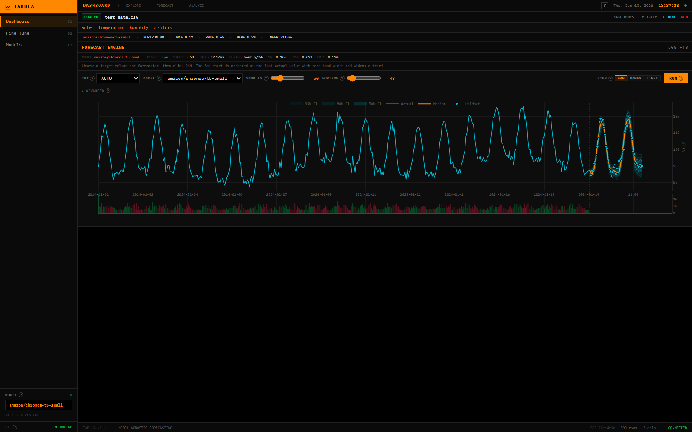 | 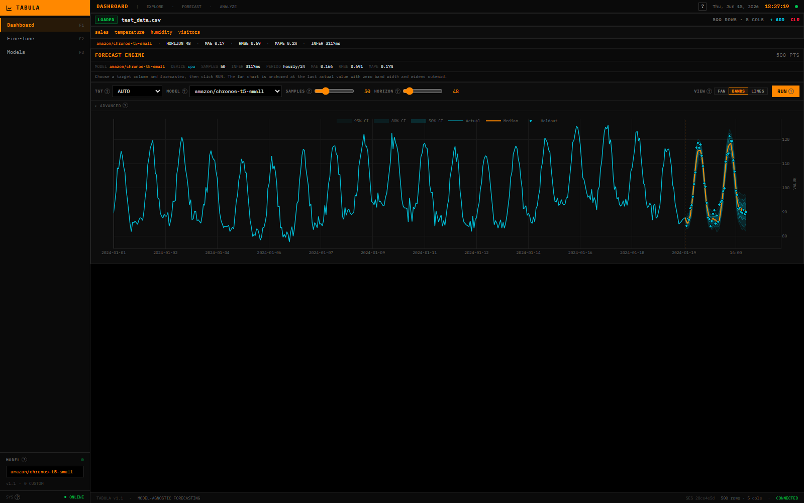 | 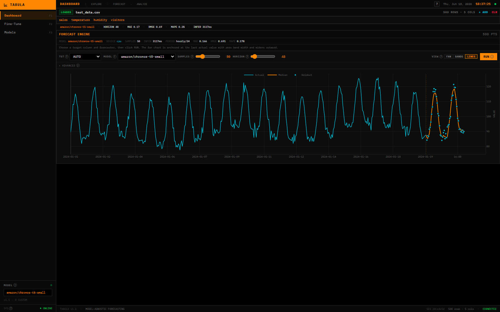 |

**Notice the dashed amber vertical line at the boundary** — that's the origin rule. The fan cone emerges from the last actual point with **zero band width** and widens outward. The median (orange) continues the historical actual line seamlessly, and the 50/80/95% CI bands (cyan) grow as forecast uncertainty increases. Cyan diamonds are holdout (back-test) markers.

### Dashboard

| Empty (drag-and-drop or Load Sample) | After upload + EDA |
|:---:|:---:|
| 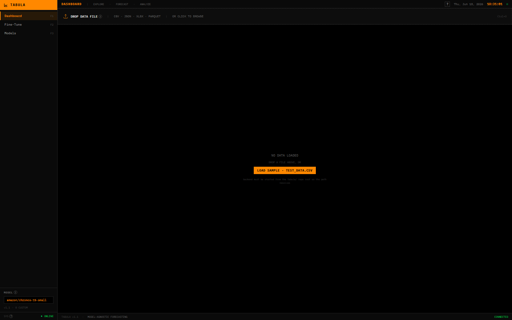 | 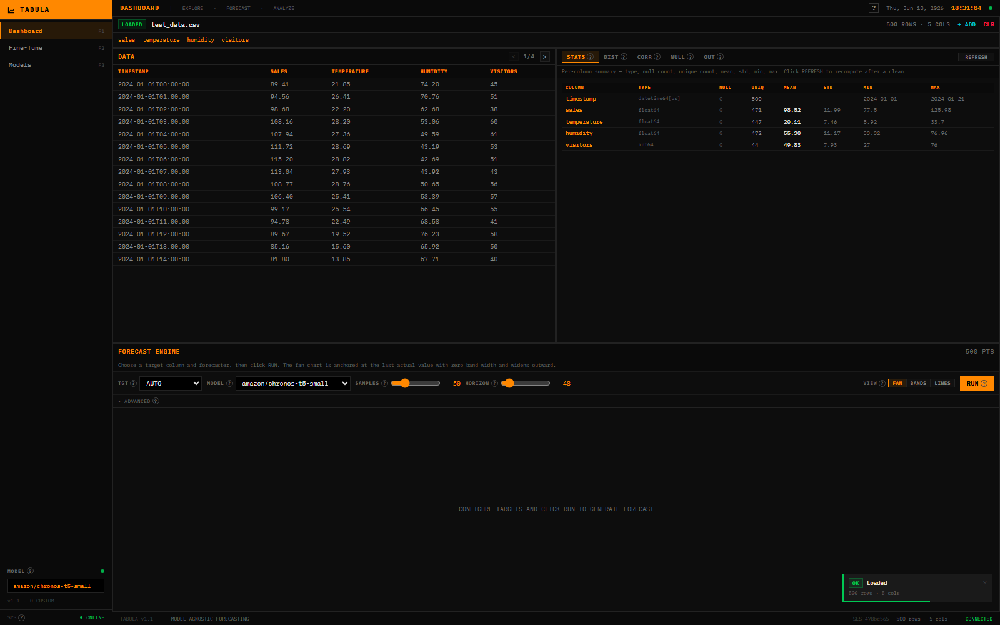 |

The empty dashboard shows the drop zone with the supported file formats and a `LOAD SAMPLE` button that pulls in the bundled `test_data.csv`. After upload, the data table (left), EDA panel (right, default `STATS` tab), and the forecast engine (bottom) become active simultaneously.

### EDA — distributions, correlations, missing values

| DIST (histogram + σ) | CORR (heatmap) | NULL (per-column clean) |
|:---:|:---:|:---:|
| 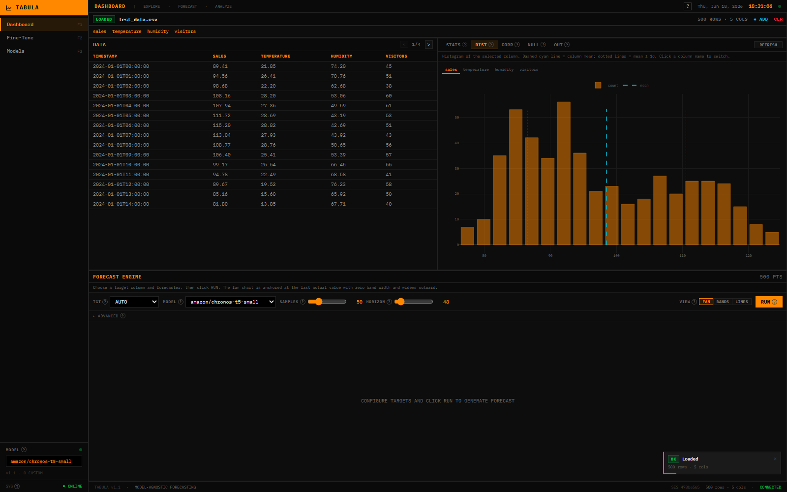 | 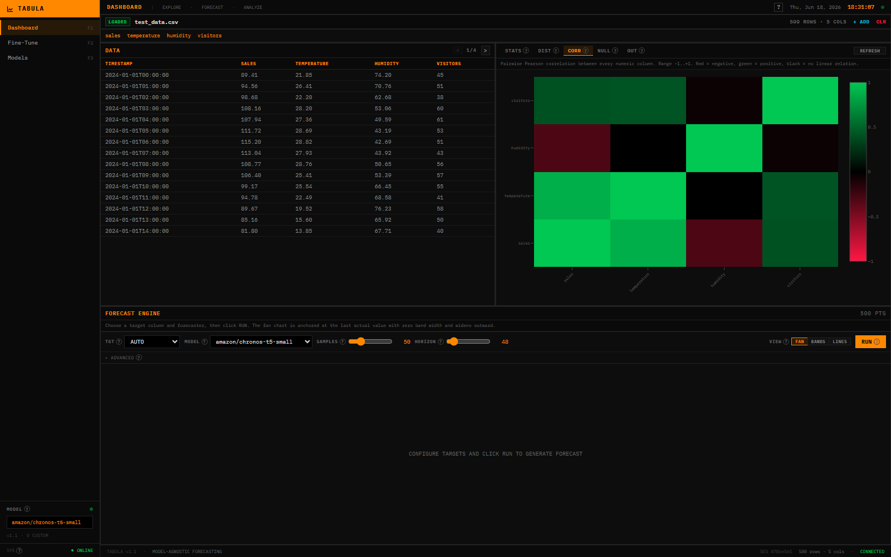 | 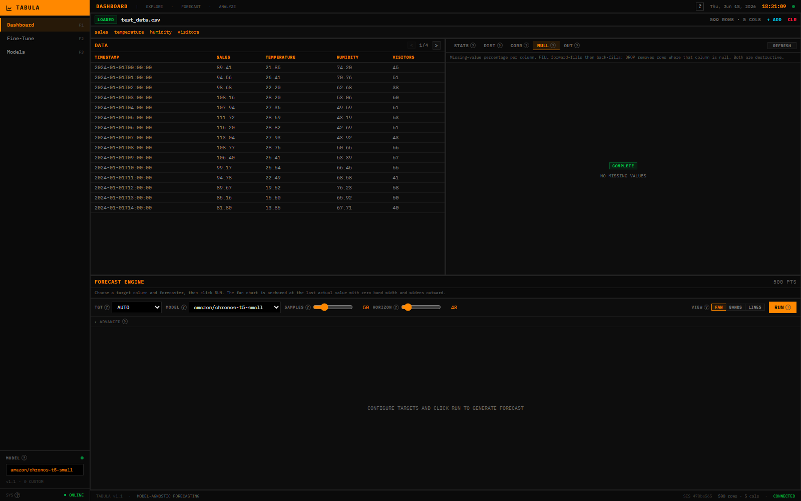 |

Each EDA tab has its own help description, a `?` tooltip, and per-column action buttons (`FILL` / `DROP` for nulls, `FILL MEAN` for IQR outliers).

### Help system

| Top bar `?` button | Global help modal |
|:---:|:---:|
| `?` in the dashboard top bar, or press `?` / `Shift+/` from anywhere | 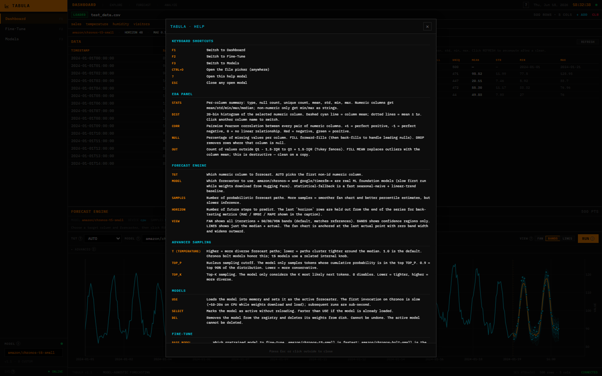 |

The help modal has 8 sections: keyboard shortcuts, EDA panel, forecast engine, advanced sampling, models, fine-tune, supported file formats, and API endpoints. Dismissable with `Esc` or click-outside.

### Fine-Tune

| Configuration | Training in progress + loss curve |
|:---:|:---:|
| 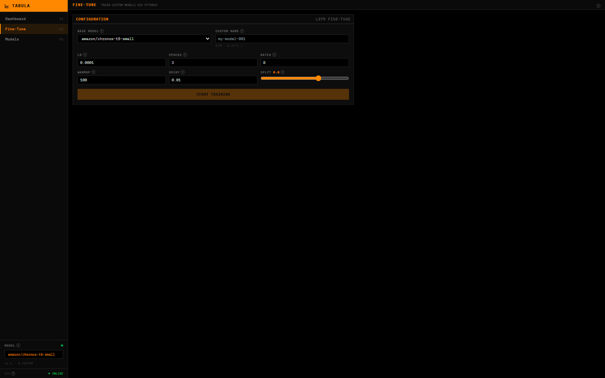 | 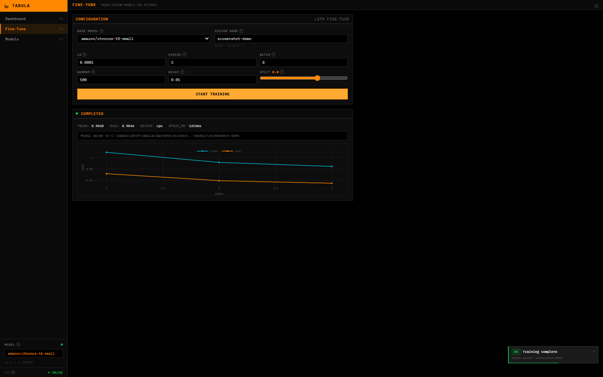 |

Live loss curve, ETA, `TRAIN` / `EVAL` / `DEVICE` / `EPOCH_MS` stats, toast on completion. Once a model is registered it appears on the **Models** page with `USE` / `SELECT` / `DEL` actions.

### Models page

| Active + registered models |
|:---:|
| 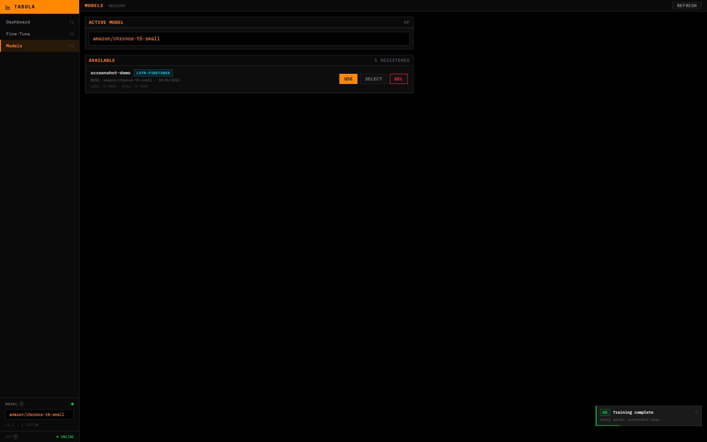 |

### Full dashboard with chart

| Full layout |
|:---:|
| 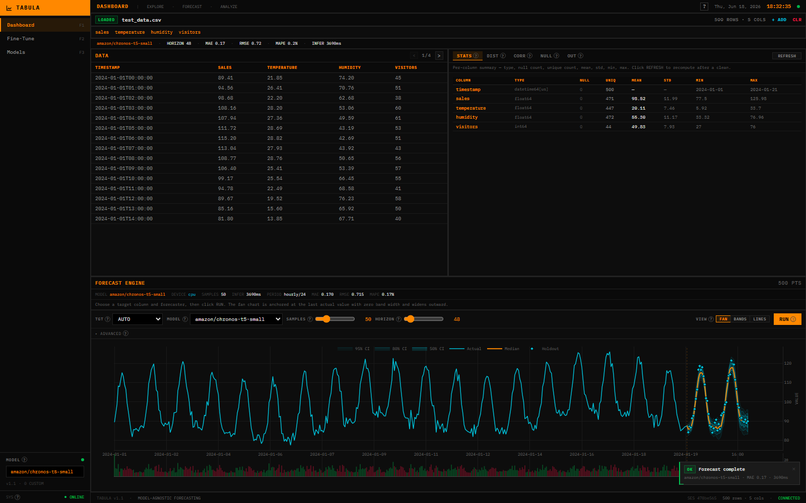 |

### [▶ Full demo video (click to watch)](tabula_demo.mp4)

---

## Features

| Feature | Description |
|---------|-------------|
| **File Upload** | Drag-and-drop or file picker for CSV, JSON, Excel, Parquet; keyboard shortcut `Ctrl+O` |
| **Load Sample** | One-click `test_data.csv` loader from the empty dashboard (or directly upload via the drop zone) |
| **EDA Suite** | Stats, distributions (with mean/σ overlay), correlations, missing values, IQR outliers — all on one panel with tabs |
| **EDA Clean** | Per-column `FILL` / `DROP` / `FILL MEAN` actions wired to `/sessions/{id}/clean` |
| **Real Chronos forecasts** | `amazon/chronos-t5-*`, `amazon/chronos-bolt-*`, `google/timesfm-*` via `ChronosPipeline` (no synthetic noise) |
| **Anchored fan chart** | Cone emerges from the last actual point with zero band width and widens outward (BoE convention) |
| **3 view modes** | `FAN` (iterations + 50/80/95% bands), `BANDS` (regions only), `LINES` (median + actual only) |
| **Seasonality detection** | Auto-detects hourly (24), daily (7), weekly (52), monthly (12) periods and passes the period to the forecaster |
| **Statistical fallback** | Seasonal-naive + linear trend + MC bootstrap — used when no Chronos model is selected |
| **Sampling controls** | `SAMPLES` (2–200), `HORIZON` (1–500), `T` (temperature), `TOP_P`, `TOP_K` |
| **Fine-Tuning** | PyTorch LSTM head on a frozen pretrained base; live loss curve, ETA, device display |
| **Model Registry** | Save, list, `USE`, `SELECT`, `DEL` custom models; engine-tagged rows; active model syncs to dropdown |
| **Session management** | `GET /sessions`, `DELETE /sessions/{id}`, `POST /sessions/{id}/clean` |
| **Health probe** | `GET /health` polled every 10s; sidebar + top bar status dot driven by it |
| **Toast bus** | Dark terminal-styled toasts for upload / forecast / training / clean events |
| **Contextual help** | Per-control `?` popovers + per-panel description strips + global help modal triggered by `?` or `Shift+/` |
| **Keyboard shortcuts** | `F1`/`F2`/`F3` to switch pages, `Ctrl+O` to open file picker, `?` to open help, `Esc` to close modal |
| **Trading Terminal UI** | Dark interface with monospace data, amber/cyan accents, Bloomberg-style density |

---

## Quick Start

### Prerequisites

- **Node.js** 18+ and **npm**
- **Python** 3.10+ with pip
- A C++ build toolchain (needed by `tokenizers`/`safetensors` on first install)

### Install

```bash
git clone https://github.com/monke-sniper/tabula.git
cd tabula

# Frontend
npm install

# Backend (creates .venv automatically if missing)
cd backend
python -m venv .venv
.venv\Scripts\pip install -r requirements.txt     # Windows
# source .venv/bin/activate && pip install -r requirements.txt   # Unix
cd ..
```

### Run

```bash
# One-shot dev launcher (handy on Windows)
npm start

# Or run them separately:
npm run backend        # uvicorn on :8420
npm run dev            # vite on :5173
npm run electron:dev   # electron desktop
```

Open **http://localhost:5173**.

> **First-run note:** the default Chronos model (`amazon/chronos-t5-small`) downloads
> from HuggingFace on first startup (~250MB cached in `~/.cache/huggingface/`).
> The backend pre-warms it in a daemon thread at startup so the first `/health` poll
> shows the model as loaded and the first `/forecast` call is fast.

---

## Usage

1. **Upload** — drag a CSV/JSON/Excel/Parquet file onto the upload zone, or `Ctrl+O`, or click `LOAD SAMPLE`.
2. **Explore** — switch the EDA tabs (`STATS`, `DIST`, `CORR`, `NULL`, `OUT`). Each tab has a help description and a `?` tooltip explaining what it shows.
3. **Clean** (optional) — in `NULL` or `OUT`, click `FILL` / `DROP` / `FILL MEAN` per column.
4. **Forecast** — set `TGT`, `MODEL`, `SAMPLES`, `HORIZON`, choose a `VIEW` (`FAN` / `BANDS` / `LINES`), click `RUN`. The fan emerges from the last actual value with zero band width.
5. **Fine-Tune** — go to `Fine-Tune`, set a name, click `START TRAINING`. Watch the loss curve + ETA.
6. **Switch Models** — on `Models`, click `USE` to make a model active and bounce back to the dashboard.
7. **Help** — click `?` in the top bar, or press `?` / `Shift+/` from anywhere. Press `Esc` to close.

---

## Architecture

```
tabula/
├── electron/                 Electron main + preload
├── scripts/                  Dev launcher + e2e tests + screenshot tooling
│   ├── start.mjs             unified backend+frontend launcher
│   ├── boot_test.ps1         boots uvicorn, dumps all OpenAPI routes
│   ├── e2e_test.ps1          15-step E2E suite (multipart upload, EDA,
│   │                          statistical+chronos forecast, anchor check,
│   │                          finetune, model lifecycle, etc.)
│   ├── capture_screenshots.py    captures dashboard/EDA/forecast screenshots
│   └── capture_focused.py        captures focused chart + training screenshots
├── backend/
│   ├── main.py               FastAPI app + lifespan warmup + /health
│   ├── services/
│   │   └── forecaster.py     Chronos + statistical engines
│   └── routers/              data / forecast / finetune
├── src/                      React frontend
│   ├── components/           Sidebar, FileUpload, DataTable, EDAPanel,
│   │                          FanChart, ForecastChart, Toaster,
│   │                          KeyboardShortcuts, HelpTip, HelpModal
│   ├── pages/                Dashboard / FineTune / Models
│   └── lib/                  api, context, toast, types
└── test_data.csv             bundled sample: 500 hourly points (sales, temp, humidity, visitors)
```

---

## Tech Stack

| Layer | Technology |
|-------|------------|
| **Desktop** | Electron 33 |
| **Frontend** | React 19 · TypeScript 5.7 · Vite 6 · Tailwind 3 |
| **Charts** | Plotly.js (via react-plotly.js) |
| **Backend** | Python FastAPI · uvicorn |
| **Data** | pandas · pyarrow · openpyxl |
| **Forecast** | `chronos-forecasting` 2.2 (Amazon Chronos T5/Bolt + Google TimesFM) |
| **ML** | PyTorch · transformers · accelerate |

---

## API Endpoints

| Method | Endpoint | Description |
|--------|----------|-------------|
| `GET`  | `/` | service info |
| `GET`  | `/health` | liveness + loaded model list |
| `POST` | `/upload` | upload data file (multipart) |
| `POST` | `/upload-path` | upload by local file path (used by "Load Sample") |
| `GET`  | `/eda/{session_id}` | column info, distributions, correlations, missing, outliers |
| `POST` | `/forecast/{session_id}` | run N-sample forecast (body: model_name, horizon, num_samples, top_p, top_k, temperature) |
| `POST` | `/forecast/cancel` | cancel in-flight forecast (returns 200) |
| `POST` | `/finetune/start` | start training (LSTM in daemon thread) |
| `GET`  | `/finetune/status` | poll training status + loss |
| `GET`  | `/finetune/loss-history` | per-step loss history for the chart |
| `GET`  | `/models` | list registered custom models + active |
| `PUT`  | `/models/active` | set the active model name |
| `DELETE` | `/models/{name}` | delete a custom model + its directory |
| `GET`  | `/sessions` | list active sessions with age |
| `DELETE` | `/sessions/{id}` | clean session (file + memory) |
| `POST` | `/sessions/{id}/clean` | apply a cleaning strategy (`drop`/`mean`/`zero`/`ffill`) |

The forecast response includes a synthetic t=0 anchor row with `is_anchor: true` — its `median` equals the last actual value and its `lower_2_5` / `upper_97_5` are also equal, so the fan chart has zero band width at the boundary and widens outward.

---

## Verification

The repo ships a 15-step end-to-end test (`scripts/e2e_test.ps1`) that boots the backend on port 8422 and runs through upload, EDA, statistical forecast, anchor verification, Chronos forecast, fine-tune, loss history, model lifecycle, and session cleanup. All 15 steps pass on the current main.

```
PASS: health
PASS: upload
PASS: eda
PASS: forecast-statistical  (asserts anchor + first real forecast)
PASS: forecast-anchor        (asserts zero-width, single-iter, median==last actual)
PASS: list-models
PASS: sessions-list
PASS: forecast-bad-model
PASS: forecast-chronos
PASS: finetune-start
PASS: loss-history
PASS: models-after-finetune
PASS: model-delete
PASS: clean-session
PASS: delete-session
```

To regenerate the screenshots in this README, run `python scripts/capture_screenshots.py` and `python scripts/capture_focused.py` while the backend + vite dev server are running.

---

## License

Apache 2.0
