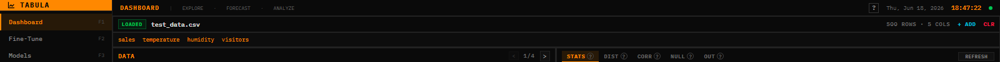

<div align="center">

# Tabula

**Model-agnostic forecasting app with a trading terminal aesthetic.**

[](https://www.electronjs.org/)
[](https://react.dev/)
[](https://www.typescriptlang.org/)
[](https://fastapi.tiangolo.com/)
[](https://github.com/amazon-science/chronos-forecasting)
[](https://pytorch.org/)
[](https://opensource.org/licenses/Apache-2.0)
[](https://raw.githubusercontent.com/monke-sniper/tabula/master/tabula_demo.mp4)

Drop a CSV. Get a fan chart.

</div>

---

## What it does

Tabula wraps Amazon Chronos (and a few other models) in a small desktop app so you can poke at a forecast the way you'd poke at a Bloomberg quote. The headline feature is the fan chart — it emerges from the last actual data point with no band and widens out from there, the same way central banks and the FT draw them. If you've ever had a forecast library hand you back a chart that visually falls below the historical line and thought "this is wrong", this is the fix.

## Screenshots

### Fan chart

| Fan view | Bands view | Lines view |
|:---:|:---:|:---:|
|  |  |  |

The dashed amber line is the origin rule. The orange line is the median. The cyan cone is the 50/80/95% confidence region. The diamonds are the back-test holdout. Three view modes because some questions want all of it and some just want the median.

### Dashboard

| Empty | Loaded |
|:---:|:---:|
|  |  |

### EDA

| Distribution | Correlation | Missing values |
|:---:|:---:|:---:|
|  |  |  |

### Help

| `?` in top bar | Global help modal |
|:---:|:---:|
|  |  |

Every control has a `?` popover, every panel has a one-line description, and `?` / `Shift+/` opens a global cheat sheet. `Esc` closes it.

### Fine-tune

| Config | Loss curve |
|:---:|:---:|
|  |  |

### Models

| Registry |
|:---:|
|  |

### Full layout

| Everything at once |
|:---:|
|  |

[▶ Watch the demo video](tabula_demo.mp4)

---

## Run it

```bash
git clone https://github.com/monke-sniper/tabula.git
cd tabula
npm install
cd backend && python -m venv .venv && .venv\Scripts\pip install -r requirements.txt && cd ..
npm start
```

`npm start` boots both the FastAPI backend (port 8420) and the Vite dev server (port 5173). Open http://localhost:5173.

First run downloads the default Chronos model (~250MB) into `~/.cache/huggingface/`. The backend pre-warms it in a daemon thread so the first forecast is fast.

If you want a desktop window instead of a browser tab: `npm run electron:dev`.

If you just want the API: `npm run backend`, then hit `http://localhost:8420/health`.

## Try it without a file

Click `LOAD SAMPLE` on the empty dashboard. It pulls in the bundled `test_data.csv` (500 hourly points, four columns) so you can see the fan chart in a few seconds.

## Stack

- **Frontend** — React 19, TypeScript 5, Vite 6, Tailwind, Plotly
- **Backend** — FastAPI, pandas, pyarrow
- **Models** — `chronos-forecasting` 2.2 (Amazon Chronos T5 + Bolt, Google TimesFM) via `ChronosPipeline`. Statistical fallback (seasonal-naive + linear trend) when no Chronos model is selected.
- **Fine-tuning** — PyTorch LSTM head on a frozen pretrained base
- **Desktop** — Electron 33

## Endpoints

```
GET  /health                              liveness + loaded models
POST /upload                              multipart CSV/Parquet/JSON/XLSX
POST /upload-path                         upload by local path (used by Load Sample)
GET  /eda/{session_id}                    column info, distributions, correlations, nulls, outliers
POST /forecast/{session_id}               run forecast; body: model_name, horizon, num_samples
POST /forecast/cancel                     cancel in-flight forecast
POST /sessions/{id}/clean                 drop | mean | zero | ffill per column
GET  /sessions                            list active sessions
DEL  /sessions/{id}                       delete session
POST /finetune/start                      start training
GET  /finetune/status                     poll training
GET  /finetune/loss-history               per-step train/eval loss
GET  /models                              list registered custom models
PUT  /models/active                       set active model name
DEL  /models/{name}                       delete custom model
```

The forecast response includes a synthetic t=0 anchor row with `is_anchor: true` — its `median` equals the last actual value, and its bands are zero-width. The fan cone emerges from that point and widens outward.

## Verify it works

```bash
npm run typecheck        # tsc --noEmit
npm run build            # vite build
powershell scripts/e2e_test.ps1
```

The E2E script boots the backend on port 8422, uploads the sample CSV, runs EDA, runs a statistical forecast, asserts the anchor row, runs a Chronos forecast, starts a fine-tune, polls to completion, checks loss history, registers the model, deletes it, cleans the session, and deletes the session. 15 steps, all pass.

To regenerate the screenshots in this README:

```bash
powershell scripts/e2e_test.ps1     # in one shell, or use the running dev servers
python scripts/capture_screenshots.py
python scripts/capture_focused.py
python scripts/capture_help_trigger.py
```

## Layout

```
tabula/
├── electron/                 Electron main + preload
├── scripts/                  start.mjs, e2e_test.ps1, capture_*.py
├── backend/
│   ├── main.py               FastAPI app + lifespan warmup
│   ├── services/forecaster.py    Chronos + statistical engines
│   └── routers/              data, forecast, finetune
└── src/                      React frontend
    ├── components/           Sidebar, FileUpload, DataTable, EDAPanel,
    │                          FanChart, ForecastChart, HelpTip, HelpModal,
    │                          Toaster, KeyboardShortcuts
    ├── pages/                Dashboard, FineTune, Models
    └── lib/                  api, context, toast, types
```

## License

Apache 2.0
